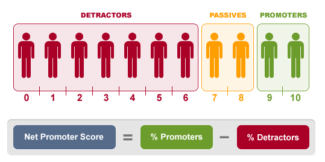

 

# Net-promoter-score-NPS-
Analyze the Net promoter score (NPS) survey data
(Net promoter score (NPS) is a market research metric that is based on a single survey question asking respondents to rate the likelihood that they would recommend a company	product, or a service to a friend or colleague)

NPS is a metric used in market research to measure customer satisfaction and loyalty. In this case, respondents have rated their likelihood of recommending a product or service, probably on a scale of 1 to 10

Understanding NPS:

  Promoters (score 9-10): Enthusiastic customers who will keep buying and refer others.
  
  Passives (score 7-8): Satisfied but not enthusiastic. They’re vulnerable to competitive offerings.
  
  Detractors (score 0-6): Unhappy customers who could potentially damage brand reputation.

  Steps for Analysis:
  
Data Cleansing: Clean the data to ensure proper format and remove any null or unnecessary values.

NPS Calculation: Calculate the NPS score using the formula:

NPS=(Promoters−Detractors)/Total Respondents×100
Summary Statistics: Generate basic statistics like mean, median, and distribution of the responses.

Visualization: Create histograms and pie charts to visualize the distribution of promoters, passives, and detractors.

Result

(count    1165.000000 
 mean        7.247210 
 std         2.806289 
 min         1.000000 
 25%         5.000000 
 50%         9.000000 
 75%         9.000000 
 max        10.000000 
 Name: Score, dtype: float64, 
 23.605150214592275) 
 
  
 Insights from the NPS Survey Data: 
NPS Score: The calculated NPS score is 23.61. This indicates that there are more promoters than detractors, suggesting a generally positive sentiment, but there is still room for improvement. 

Summary Statistics: 

Mean Score: 7.25 
Median Score: 9.00 
Standard Deviation: 2.81 
Min Score: 1 (indicating some highly dissatisfied respondents) 
Max Score: 10 (indicating some highly satisfied respondents) 
Distribution: Most respondents gave a score of 9, which falls into the "Promoter" category, with fewer responses in the lower range (Detractors). However, there is still a significant number of "Passive" scores (7-8), suggesting neutral feelings. 

Conclusion from the NPS Survey Data: 

The analysis of the survey data reveals that the company or product has an overall positive reception, as reflected by an NPS score of 23.61. This indicates that there are significantly more Promoters (customers who are highly likely to recommend the product) than Detractors (those dissatisfied or unlikely to recommend it). However, a notable portion of respondents fall into the Passive category, reflecting customers who are neutral or indifferent. 

Key Takeaways: 
Strong Promoter Base: A substantial percentage of respondents scored 9 or 10, showing a loyal customer base that could help drive growth through word-of-mouth recommendations. 
Passives Need Attention: The group scoring 7 or 8 represents customers who are satisfied but not enthusiastic. Improving their experience could shift them into the Promoter category. 
Presence of Detractors: While relatively small, the presence of Detractors (scores of 6 or below) highlights potential issues or dissatisfaction. Addressing their concerns could help improve the overall customer sentiment and the NPS score. 

Recommendation: 
To further enhance customer loyalty and satisfaction, focus on engaging with the Passives and addressing the concerns of Detractors. This could increase the NPS score and contribute to a more enthusiastic customer base. 
